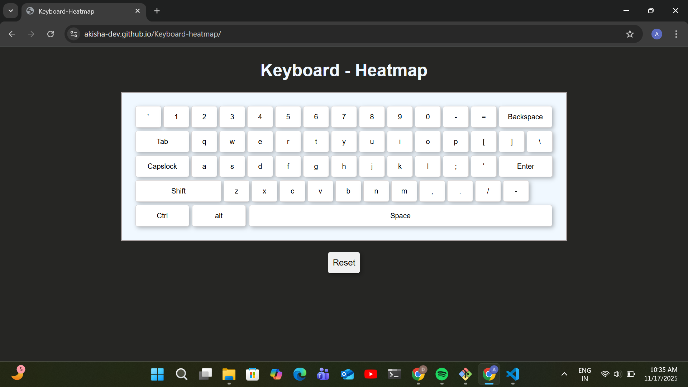

# Keyboard Heatmap

A visual keyboard that tracks typing patterns using color gradients.

## Features
- Real-time color changes based on key press frequency
- Gradient: white → yellow → red
- Reset button to clear data

## Tech Stack
- Vanilla JavaScript
- HTML5
- CSS3

## How to Use
1. Open `index.html` in browser
2. Start typing
3. Watch keys change color
4. Click Reset to clear

## What I Learned
- DOM manipulation
- Event listeners
- HSL color math
- Keyboard event handling

## Demo  
Live: https://akisha-dev.github.io/Keyboard-heatmap/

